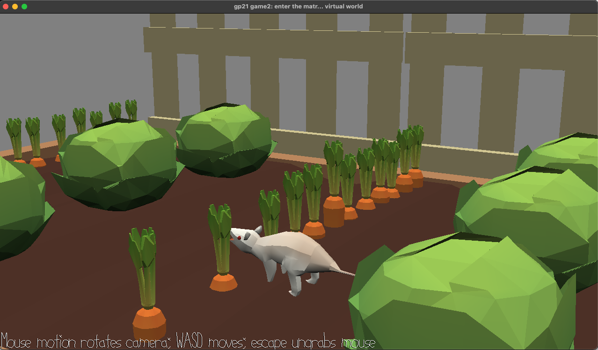

# Greedy Mouse: Autumn Harvest

Author: Liang Yen Chou

Design: It's autumn, time for harvest! Collect as many meature carrot as you can!

Screen Shot:

How To Play:

Use mouse motion to rotate camera; Use WASD to move camera ; Escape ungrabs mouse; Use arrows to control water opossum to eat the carrot!

Sources: This game is based on game2 base code, and reference previous project: hungry man https://github.com/CandyDong/15-466-f20-base2 ; The models and scene credit to Yixin He's amazing works: garden.blend.

This game was built with [NEST](NEST.md).

